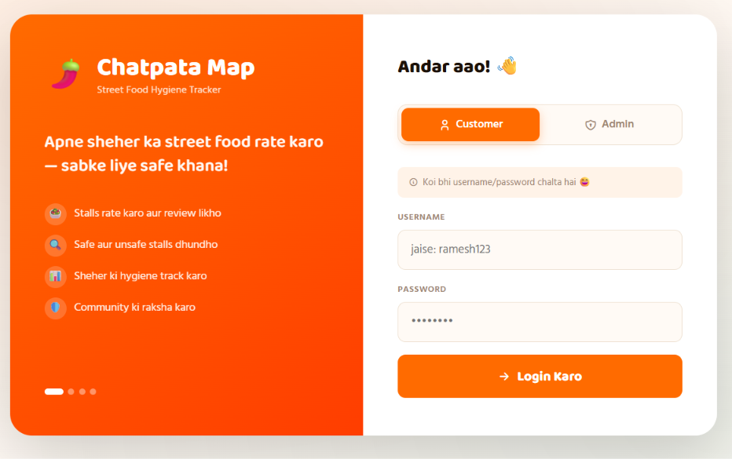
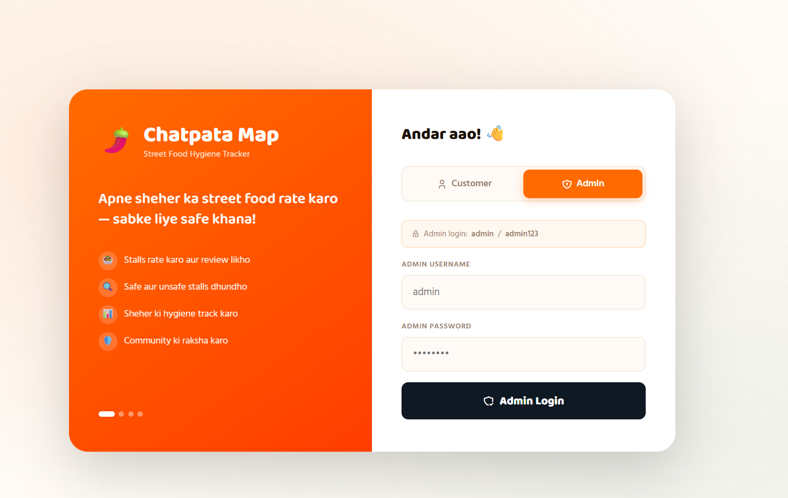
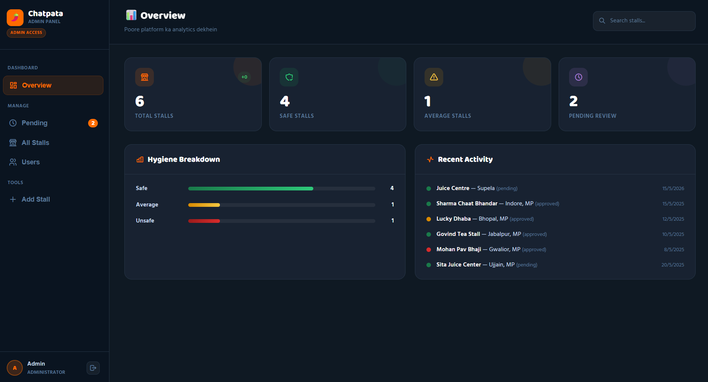

# 🌶️ Chatpata Map — Street Food Hygiene Tracker

A community-driven web app for rating and tracking street food stall hygiene across Indian cities. Built with plain HTML, CSS, and JavaScript — no frameworks, no backend.

---

## Screenshots

### Login Page — Customer View


### Login Page — Admin View


### Admin Dashboard — Overview


---

## Features

**Customer Portal**
- Login with any username and password (no registration required)
- Add new street food stalls with name, area, food type, and hygiene rating
- Rate stalls as Safe 😋, Average 😐, or Unsafe 🤢
- Write reviews in Hindi or English
- Filter and search stalls by rating, name, or area
- View live stats: total stalls, safe count, average count, unsafe count
- Newly submitted stalls go into a pending queue for admin approval

**Admin Panel**
- Secure login (`admin` / `admin123`)
- Overview dashboard with hygiene breakdown bar chart and recent activity feed
- Pending queue: approve or delete user-submitted stalls
- All Stalls table: filter by rating, edit details, delete entries
- Users table: see all contributors and their submission counts
- Add new stalls directly from the admin panel

---

## Getting Started

No build step or server needed. Just open the file in a browser.

```bash
# Clone or download the project
git clone https://github.com/your-username/chatpata-map.git
cd chatpata-map

# Open directly in browser
open index.html
```

### Login Credentials

| Role | Username | Password |
|------|----------|----------|
| Customer | Any | Any |
| Admin | `admin` | `admin123` |

---

## Project Structure

```
chatpata-map/
└── index.html        # Entire app (HTML + CSS + JS in one file)
```

All data is persisted to `localStorage` under the key `cm_stalls2`, so stalls survive page refreshes within the same browser.

---

## Tech Stack

- **HTML5 / CSS3 / Vanilla JS** — zero dependencies
- **Google Fonts** — Baloo 2 (headings) + Hind (body)
- **Tabler Icons** — icon webfont via CDN
- **localStorage** — client-side data persistence

---

## Default Seed Data

The app ships with five sample stalls to demonstrate the UI:

| Stall | Area | Rating | Status |
|-------|------|--------|--------|
| Sharma Chaat Bhandar | Indore, MP | ✅ Safe | Approved |
| Lucky Dhaba | Bhopal, MP | ⚠️ Average | Approved |
| Govind Tea Stall | Jabalpur, MP | ✅ Safe | Approved |
| Mohan Pav Bhaji | Gwalior, MP | ❌ Unsafe | Approved |
| Sita Juice Center | Ujjain, MP | ✅ Safe | Pending |

---

## Customisation

- **Add food types:** Edit the `food-pills` section in the HTML and the `<select id="addFood">` / `<select id="editFood">` dropdowns.
- **Change admin credentials:** Edit the `loginAdmin()` function — replace `'admin'` and `'admin123'` with your own values.
- **Change brand name/tagline:** Update the `.brand-name`, `.brand-sub`, and tagline text near the top of the `<body>`.
- **Colour scheme:** All colours are CSS custom properties defined in `:root` — change `--saffron`, `--green`, `--chili`, etc. to retheme the app.

---

## Roadmap

- [ ] Real backend with user authentication
- [ ] Map view with pins for each stall
- [ ] Photo upload per stall
- [ ] Multi-language support (Hindi UI toggle)
- [ ] Export stall data as CSV

---

## License

MIT — free to use, modify, and distribute.
